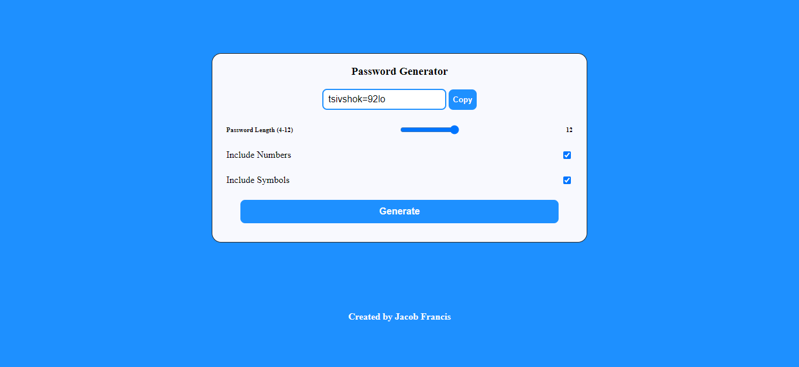

# Password Generator Built With HTML5, CSS And Vanilla Javascript.

## Table of contents

- [Overview](#overview)
  - [Screenshot](#screenshot)
  - [Links](#links)
- [My process](#my-process)
  - [Built with](#built-with)
- [Author](#author)

## Overview

### Screenshot 📷

### Links

- Live Site URL: [Password Generator](https://javascriptt-password-generator.netlify.app/)

## My process

### Built with

- Semantic HTML5 markup
- CSS Custom Properties
- Vanilla Javascript

## Author

- Github - [ Francis Jacob](https://github.com/Jacbfrancis)
- Twitter - [@jacobxavier_](https://twitter.com/jacobxavier_)
